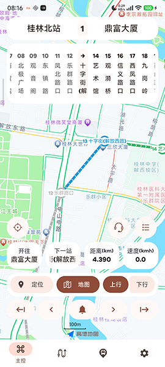

# MicroBusAnnouncer

### 这是什么？

`Announcer`是一款Android公交报站器，集成了<b>语音播报</b>，<b>运行图展示</b>，<b>电显模拟</b>等功能。

[演示视频](https://bilibili.com)

  
  
  
  

### 快速开始

无需过多配置，只需要一些步骤即可体验Announcer的基本功能。

1. 准备一台Android 8.0+的手机，从下列渠道下载最新版，然后安装。

   [Github](https://github.com/Shiyue0x0/MicroBusAnnouncer/releases)
   [Gitee](https://gitee.com/shiyue0x0/micro-bus-announcer/releases)
   [蓝奏云](https://github.com/Shiyue0x0/MicroBusAnnouncer/releases)

2. 下载体验语音库。

   [Github](https://github.com/Shiyue0x0/MicroBusAnnouncer/releases)
   [Gitee](https://gitee.com/shiyue0x0/micro-bus-announcer/releases)
   [蓝奏云](https://github.com/Shiyue0x0/MicroBusAnnouncer/releases)

3. 将其中的`Announcer`文件夹解压到手机的根目录。

4. 启动应用，并授予所需的权限。

5. 点击右下角的`设置`-`数据与关于`，点击`加载预设站点数据`，此时应用会自动关闭。

6. 再次打开应用，点击`设置`-`数据与关于`-`加载预设路线数据`，自动关闭后再打开应用。

喜报！您已经完成了所有的初始设置。现在可以试着自行探索一下，或者是继续跟随文档操作。

### 开始运行

1. 现在，来试着运行路线。请先点击左下角的`主控`，接下来大部分的操作会在`主控`页进行。

2. 点击最上方的`模拟电显`，然后选择要运行的路线。也可以点击`线路`页中更换路线。

3. 此时，您选择的路线已经开始运行。`Announcer`在前台运行时会根据实时定位，在进站和出站时进行自动报站。

4. 如果您的定位没有改变，就无法触发自动报站。虽然但是，您仍可以点击界面下方中央类似铃铛的报站按钮，来试听报站。

5. 点击电显下方路线运行图任意一个站点，然后点击`当前站点`按钮，就会切换到这一站，再次点击报站按钮试听当前站点的报站。

要继续了解`Announcer`？请按需参阅这些文档：

1. 语音播报
   [GitHub](https://github.com/Shiyue0x0/MicroBusAnnouncer/blob/master/readme/语音播报.md)
   [Gitee](https://gitee.com/shiyue0x0/micro-bus-announcer/blob/master/readme/语音播报.md)

2. 模拟电显
   [GitHub](https://github.com/Shiyue0x0/MicroBusAnnouncer/blob/master/readme/模拟电显.md)
   [Gitee](https://gitee.com/shiyue0x0/micro-bus-announcer/blob/master/readme/模拟电显.md)

3. 自定义站点与路线
   [GitHub](https://github.com/Shiyue0x0/MicroBusAnnouncer/blob/master/readme/自定义站点与路线.md)
   [Gitee](https://gitee.com/shiyue0x0/micro-bus-announcer/blob/master/readme/自定义站点与路线.md)

